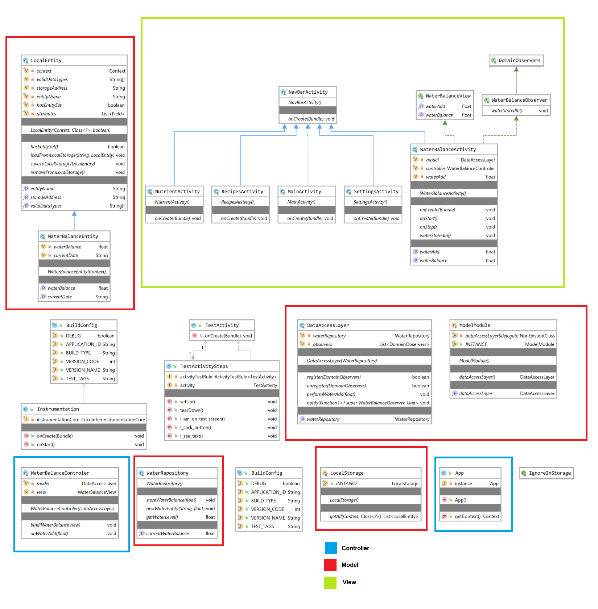

a# Mood4Food - SAD
## Software Architecture Document

Version 1.0
 
Revision History
| Date       | Version	| Description | Author|
|------------|----------|-------------|-------|
| 30.11.2020 | 1.0 | First written version | Jan Pfenning |

# Table of contents
 
1. [Introduction](#Introduction)
    1.	[Purpose](#Purpose)
    2.	[Scope](#Scope)
    3.	<a href="#Definitions-Acronyms-Abbreviations">Definitions, Acronyms, and Abbreviations</a>
    4.	[References](#References)
    5.	[Overview](#Overview)
2.	[Architectural Representation](#Architectural-Representation)
3.	[Architectural Goals and Constraints](#Architectural-Goals-and-Constraints)
4.	[Use-Case View](#Use-Case-View)
    1.	[Use-Case Realizations](#Use-Case-Realizations)
5.	[Logical View](#Logical-View)
    1.	[Overview](#Logical-Overview)
    2.	<a href="#Architecturally-Significant-Design-Packages">Architecturally Significant Design Packages</a>
6.	[Process View](#Process-View)
7.	[Deployment View](#Deployment-View)
8.	[Implementation View](#Implementation-View)
    1.	[Overview](#Implementation-Overview)
    2.	[Layers](#Layers)
9.	[Data View](#Data-View)
10.	[Size and Performance](#Size-and-Performance)
11.	[Quality](#Quality)
12. [Patterns](#Patterns)
13. [Metrics](#Metrics)
 
Software Architecture Document 
#	Introduction
Our software is an adnroid application for managing recipes and healthstatistics, which follows the MVC concept. In this document, a list of information about the architecture is given. 
##	Purpose
This document provides a comprehensive architectural overview of the system, using a number of different architectural views to depict different aspects of the system. It is intended to capture and convey the significant architectural decisions which have been made on the system.
## 	Scope
The scope of the SAD applies to the complete application, therefor for <a src="https://github.com/JanPfenning/Mood4Food">this implementation</a>
##	 Definitions, Acronyms, and Abbreviations
| Abbrevation | Explanation                            |
| ----------- | -------------------------------------- |
| SAD         | Software Architecure Document          |
| UC          | Use Case                               |
| n/a         | not applicable                         |
| tbd         | to be determined                       |
| UCD         | overall Use Case Diagram               |
##	References
Every referenced document can be viewed <a href="https://github.com/JanPfenning/Mood4Food_doc">here</a>
##	Overview
To have an overview please see <a href="#toc">the table of contents</a>
#	Architectural Representation 
Our application is set up to use a MVC-architecture which looks as follows:

<a href="https://viewer.diagrams.net/?highlight=0000ff&edit=_blank&layers=1&nav=1&title=MVC_Architecture.drawio#Uhttps%3A%2F%2Fraw.githubusercontent.com%2FJanPfenning%2FMood4Food_Doc%2Fmain%2Fembedded-files%2FMVC_Architecture.drawio">MVC-Architecture</a>

#	Architectural Goals and Constraints 
We are not using a tool to implement the MVC-architecture. Since we want to learn about the architecture we prefer to implement it by hand, especially because the "innate Android version of MVC" is not really applicable to a real MVC concept. The seperation of code that implements logic and code that is used to display data is important for structure. By doing this one could just replace a View and you just have to reconnect the references which you cut off and the application is running.

#	Use-Case View 

<a href="https://viewer.diagrams.net/?highlight=0000ff&edit=_blank&layers=1&nav=1&title=UC#Uhttps%3A%2F%2Fraw.githubusercontent.com%2FJanPfenning%2FMood4Food_Doc%2Fmain%2Fembedded-files%2FUC.drawio">Overall Use-Case Diagram</a>

##	Use-Case Realizations
In the water-section of the application, the user is able to add water to his todays waterbalance, which is part of the waterbalance-usecase. On adding water to the balance the view notifies the controller that an event has been triggered. The controller upadtes the model with the given data (how much water has been added) and the Model notifies the View that there is new data to be loaded, which is then loaded from the Model by the View itself.

#	Logical View 
We devided the application into the 3 major layers: Activity(View), Repository(Model) and Controller for each use-case. There is also the layer of .xml visualization which holds the templates of the actual pages and subpages you see.
##	Overview
Every catergory (like recipe, water, ...) gets it own package which then contains subpackages for each use-case. Each use-case contains the model, view and controller classes as further subpackages
##	Architecturally Significant Design Packages
The abstract version of the MVC-Diagram can be found <a href="#toplevelmvc">here</a>
The following image is out-dated by now. But android/kotlin does not provide any reasonable tool to automate the generation of this view.
</img>

The reason why its light-background is that the background of the IDE is snipped out and thrown away! Do not think we use lightmode! For gods sake.

#	Process View 
(n/a)
#	Deployment View 
The application is deployed as an APK with every build. This APK can be run on any android phone with a matching version.
#	Implementation View 
(n/a)
<!--[This section describes the overall structure of the implementation model, the decomposition of the software into layers and subsystems in the implementation model, and any architecturally significant components.]-->
##	Overview
(n/a)<!--[This subsection names and defines the various layers and their contents, the rules that govern the inclusion to a given layer, and the boundaries between layers. Include a component diagram that shows the relations between layers. ]-->
##	Layers
(n/a)<!--[For each layer, include a subsection with its name, an enumeration of the subsystems located in the layer, and a component diagram.]-->

#	Data View
Our project does not contain a DB, since we use the shared-preferences of an phone. We safe a shared-preference file for each recipe, which contains the data about the title, ingredients, materials, description, linked picture and when it was eaten the last time. We also save a shared-preference file which contains the data of your water-balance each day.

#	Size and Performance 
The application does not have to scale for many usecases. The only thing that can happen, is that a person saves houndreds of recipes but this is totally applicable with the App, since a shared-preference file is only ~4kb in size

#	Quality 
The software is easy to extend since we use a selfmade MVC architecture. It is totally reliable since the App is running on the phone without the need of an outside source, which also makes it totally save. The personal data is never leaving the phone unless the user exports his information for transfering it to a new phone or so.

#   Patterns
We used the Proxy-Pattern in our Backend. Check our Blogpost for further Information.
https://md4fd.wordpress.com/2021/05/16/week-2-7-patterns/

#   Metrics
Find the information in our Blogpost:
https://md4fd.wordpress.com/2021/05/28/week-2-9-metrics/
