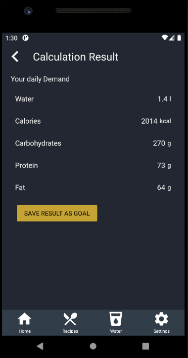

# Use-Case Specification: Get Health Demand Information

# 1. Get Health Demand Information

## 1.1 Brief Description
This use case allows users to see what amount of nutrients and water is healthy, based on bodymessure information

## 1.2 Mockup
n/a

## 1.3 Screenshot

# 2. Flow of Events

## 2.1 Basic Flow
<a href="https://viewer.diagrams.net/?highlight=0000ff&edit=_blank&layers=1&nav=1&title=Calculation#R7Vttc5s4EP41%2FtgOSIDxx9p5uev0ep3zdNr0m4JlrAlGHiHHcX%2F9SUYYkLBNHDC200xmglZCQvs8u9pdSA%2BO5i%2F3DC1m%2F9AJjnrAmrz04E0PAFv8ij9Ssk4lnuOmgpCRiRqUC8bkN1ZCS0mXZIKT0kBOacTJoiwMaBzjgJdkiDG6Kg%2Bb0qi86gKF2BCMAxSZ0h9kwmdKanuDvOMvTMKZWtoHXtrxiIKnkNFlrNbrATjd%2FKTdc5TNpTaazNCErgoieNuDI0YpT6%2FmLyMcSd1makvvu9vRu31uhmNe5waQ3vCMoqXa%2BvcEM%2FVsfJ3pI1mReYRi0RquZoTj8QIFsmsl4DeXVE%2FxjBnHLwWReoR7TOeYs7UYkvV6zkdFkHVGIT9tr3L1A18pbVbQvNtXQqQgD7ez59sWF2rn1VpwDS0YGhA3CPJJBQjIFlKYcMT4mCMuhVMSRSMaUbYZDa3NjxzMGX3ChZ7pVPWYagOvVptllZTmWIbOYIXKYAMa82pobCJMSjVx9EhXt7lguBGIjhll5DeNORILDeXOiTDCTxEJY9H5SDmnczk6nnySVi1kdIHjVKK8hl%2Bl5bs7pWUx7o7IXdzYorUxTCy3YO1Uf0KXLMAlXsidvAWPKkWrSb5RItbPZ7Bd3RBsbRLBuhBzdZ8G2PaRamHof4aLKLCGnxfhj18UR%2FNPDH7wbAPZUUSCJyG6x%2FJJ%2F8PJMpIXw6VAJzZgz3VsV3oLOJzxeQYIYoGC0ZFoTQUTqqxIsy7pT4M61mWYUgXie9AsAQEGwLAuG1SY1z7U65pXJTSO6aYyaG4nREJyT1GUXDEiULeO7kHx%2FJ2gjNEz3hpMki6eYvQOrMfToXKcE0IFDVDG64Tj%2BakDG8fpNrCp9iMDQztf0TMJZSQj4%2Bwe8ISDh8NHEQd6oby6eL8CX8fVM3ArjulWUBQsoxSkrxhP3hMg0O0akMwaiy5F8%2B%2B61WzdfbLDrL7QYHMWjDllMiG9Wjz73R4G5hFtqNpM72SGcWRyV62d15wbwv1rGnOBqbG2krtKA3BNAzC1WEj5KOMzGtIYRcW8r0DY5rK9LVWFwtn6pxBaQnuq%2BSCbWePmpdRaq1avKs2rhLCYHe49XNM0rUhAE2yGhTsnz%2BVF6yeLjrvTrA4ki0K9aF0YtpADkt0rAccuu2MbaHxKZ2w0E%2B2D6yUcfiH8p3osef2QTyFa%2BU2y0QJJs8PsBCSFhu%2BHfj2SmsWRwcGp0p03URwx46%2Fvfxv025s9SN7ICmHKI4FNVc3v1RlFH5xjRmEWjfaa6rmWA%2FcaV9u1P9AflGYAtn%2BcnYiJdIoMtKmas5NqPpiu%2B18JFLCyJIZcdu3jQPRm6wBs3%2Fd0Vzw0SyKqaDjGnJM4rEhg6FR0B0u22bcYSPjy3SEHYefIme9avlA0KUKjA5dDak2ZcJnXnHnuB9QFZ2eIfQNOVUgYzVAc4go7lLUD6%2F1Apr146d4Cs%2BJTAbIbkiyiTQ5VwwivFSkflJHq3rhc85TbG4h2mzOWMsY8gTy%2BSKFEh4sU6kgp5n97mN94Uuj5monrhGj5JbdrZnfnS5MP1kfLc8pccfz%2BoQqDbH3DjAhdYdYChUBNCqVca5xCQKMQGJyYQnW%2BGeqYQk3CvaPA%2F0YUjbPePTGKr%2FyO6RJrjHld8aGXVxyPrjHWZYxb20G0Qy1fP2PAiallxvl%2FqNWQM%2BrXpZbbztljFNgc%2FbVb21%2FpXVSce53k8nYkR28ObAxy1YyOzdNVd4G%2BNlHLZWDvol4Zd5eNuXXd2aAdxrmWzrg%2BPK07MwssV0OUBt3ZQSZ5u1l42J057ZALln2Qe%2BIwzDMj%2FLx2V3oblX%2FIdbX1Oi3bcvyu63XenyC5GcP33mD47Xz44fc1w9eDj7YN%2FwIKNA0HH4dp4ryBJu3U8VydJvpHKm3TxPwY%2FuxocjTc%2FvFw961W4DZTZ6%2Bx1Fk083%2BcTYfn%2F50Mb%2F8H">here</a> is the activity diagram getting the health demand information.

## 2.2 Alternative Flows
n/a

# 3. Special Requirements
The user has to have entered the bodymessures in the "Settings" section.

# 4. Preconditions
The main preconditions for this use case are:

 1. The user has started the app and has navigated to "Settings" section.

# 5. Postconditions

### 5.1 Save changes / Sync with server
n/a

# 6. Function Points
tbd
Get Health Demand	| RET	| DET | FTR | Resulting Complexity | Count || RET || DET || FTR
External Inuts	    ||0     ||	1   || 0	||low	|| 1	||	- || Navigation	|| -
External Outputs	|| 0	|| 4	|| 1	|| low	|| 1	||-||	Calories, Carbohydrates, Proteins, Water ||Settings
External Inquiries	0	0	0	low	0			
Internal Logical Files	0	0	1	low	1			Settings
External Interface Files	0	0	0	low	0			
Function Points	13,02							

<!--
To calculate function points, we used the tool on [http://groups.umd.umich.edu](http://groups.umd.umich.edu/cis/course.des/cis375/projects/fp99/main.html).

Functionpoints and implementationtime needs to be determined -->
