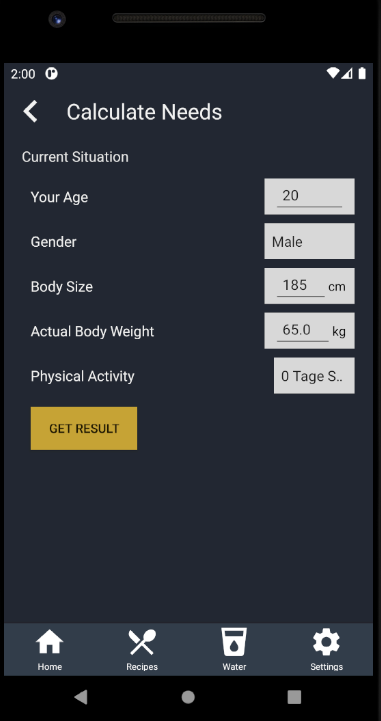
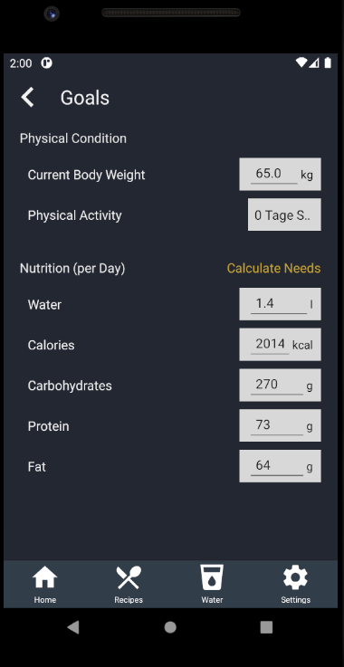

# Use-Case Specification: Manage Settings

# 1. Manage Settings 

## 1.1 Brief Description
This use case allows the user to manage Settings concerning his health.
Bodyvariables like height or mass and further variables describing goals the user wants to reach.

## 1.2 Mockup
n/a

## 1.3 Screenshot

### Insert Personal Data

### Adjust/Personalize Calcualted Result

# 2. Flow of Events

## 2.1 Basic Flow
<a href="https://viewer.diagrams.net/?highlight=0000ff&edit=_blank&layers=1&nav=1&title=Goals#R7Vpbc5s4GP01fmxGgMDw2NhxurNdb2Y8nbaPCsigBiOPkG%2F99SsZES7CDrGNL5t6MhP0SSB0zvkukt2zBrP1I0Pz6B8a4LhngmDds4Y90zTEn%2FgnLZvM4kA7M4SMBGpQYZiQ31gZgbIuSIDTykBOaczJvGr0aZJgn1dsiDG6qg6b0rg66xyFWDNMfBTr1u8k4JGyGo5XdHzBJIzU1K7pZB3PyH8JGV0kar6eaU23n6x7hvJnqYWmEQroqmSyHnrWgFHKs6vZeoBjiW0OW3bfaEfv63sznPA2N5jZDUsUL9TSv6WYqXfjmxyPdEVmMUpE634VEY4nc%2BTLrpWgX59SvcUSM47XJZN6hUdMZ5izjRiS9zrwTglkk0vIzdqrAn7TVaBFJeTtvjIiRXn4%2BvRi2eJCrbwZBVtDQUNA3CDEJwEQlM2lMeWI8QlHXBqnJI4HNKZsO9oC248czBl9waWe6VT16LCZ74YNgApoEGiYWQ2QWSdAzGmBWCBcSjVx%2FExXD4XhfmsQHRFl5DdNOBIT3cuVE%2BGEn2MSJqLzmXJOZ3J0EnyWXi1sdI6TzKKihtuE8mikUBbjRkSuYmiI1tYxsVwC2Al%2FShfMxxVdyJUcw0cT0OohT5SI%2BYsnGHVH8GrPEKILMVe31fh6faNWFP7tfnkcT75Px0PuicA1%2BvXya%2FYJGhqx%2F0rETfBIUZxqJBeIGo2xwbqP%2BCyHHzFfkQYlN1PBe5PP1HxJRk%2B%2FjS9pjtPA707u7BrspuZKhtngS%2FsobutLjUTYQCPiISBSKk%2FRJpVeIi4HNBE2QpMPw4sJLk6MHvoUMeMFZx%2BLDevybHgaG4OY%2BC%2FSOVDsL2KZnk0nFu9x%2FyzqGieUV2OMg48Ty%2BA5WbI0PiablOOZhnbHJSWEly0pm7Orq6HzlaJAbmQWbLtYTaoq7QI5sQkmmHOShNIwZaI00oZ%2FpVlmmHDK5B7nhjVu7eXXBfVC6eKhCOrSR0ssI1GEklBsZzW2OBW9H4Yyx767umSuO%2BQfzvZydvmU7%2BhnFmO0JOE20wNJT1O6LxUEN16hvZOws2b%2FZsL0mkDDv3xYQBmPaEgTFJdPDEr4n%2B6c4BV5gS7b%2FBBGmVZU86ds5o3hutLaqFav6YCgeoiwV8QasULB2x2%2BMrnNZDMsdbysTtr%2BmAGadZXYuUpOf85g6TFWp187XZPEHXi2tgvYdxysGfXqwjZ0L%2BrqbE2vI779pSHWcfncN6%2BwfLb1yD8k6TxGm30VdFEz327Mh3vJ8urefPFaGOrb8isO%2BZWAX8T%2FE4f8fPPX4JflkL9H%2BSfPA45bPbC26oLo%2BrRZd%2BjrlckncAccWNUKdPtvqGXbesKMCKwwO1ZCDaGhrYRgN6WEWZPQub%2BwsPUvLK5OQofSbTfUMjvS9pEs2kYtENhnZvF%2FvEXAa8JLt4nWT%2FWS8rq4STaOzTF5hXRQjgGdSMut5xjzzNJq8%2BX%2BH2m9LS14hLScbqJWvyotWN99dS2t%2Fi1J6zxVbv716EEyOU%2BJYoPzysS5gRLlkEhy4jOzBsW8rTa3rbS8bqTlVaXltExuDRr17mAf2K4rai%2FTg7CqWLf22AyY7hSr%2F%2Fjk%2BhR77sDm7ZTpm%2Bpzutm%2B1wObY5wqsIlm8RvUbHjxQ1%2Fr4T8%3D">here</a> is the activity diagram for managing bodymessure settings.

## 2.2 Alternative Flows
A user may enter complete new information for further calculation, instead of altering the result by hand.

# 3. Special Requirements
n/a

# 4. Preconditions
The main preconditions for this use case are:

 1. The user has started the app and has navigated to "Recipe" section.

# 5. Postconditions

### 5.1 Save changes / Sync with server
bodymessures are stored in the local files (no information for the outside world!)

# 6. Function Points
| Manage Settings          | RET | DET | FTR | Resulting Complexity | Count | RET | DET                                                                                    | FTR      |
|--------------------------|-----|-----|-----|----------------------|-------|-----|----------------------------------------------------------------------------------------|----------|
| External Inuts           | 0   | 5   | 1   | low                  |       |     | Cur Body weight, Aim weight, Wheight Change, Wheight Change / Month, Physical Activity | Settings |
| External Outputs         | 0   | 0   | 0   | low                  |       |     |                                                                                        |          |
| External Inquiries       | 0   | 0   | 0   | low                  |       |     |                                                                                        |          |
| Internal Logical Files   | 0   | 0   | 1   | low                  |       |     |                                                                                        | Settings |
| External Interface Files | 0   | 0   | 0   | low                  |       |     |                                                                                        |          |
| Function Points          | 9,3 |