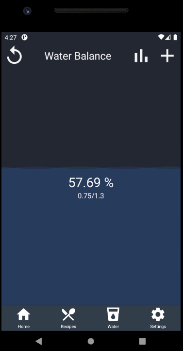
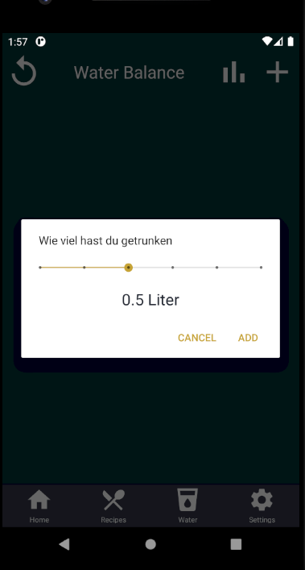

# Use-Case Specification: Manage Waterbalance

# 1. Manage Waterbalance

## 1.1 Brief Description
This use case allows users to manage the waterbalance tracked by the application.

## 1.2 Mockup
https://konrad400294.invisionapp.com/public/prototype/skghuj5co00lz1301ofl2uuaf

## 1.3 Screenshot

# 2. Flow of Events

## 2.1 Basic Flow
Here is the activity diagram for adding water to the your waterbalance.

<a href="https://viewer.diagrams.net/?highlight=0000ff&edit=_blank&layers=1&nav=1&title=Water_Management.drawio#Uhttps%3A%2F%2Fraw.githubusercontent.com%2FJanPfenning%2FMood4Food_Doc%2Fmain%2Fembedded-files%2FWater_Management.drawio">ManageWaterbalance Flow</a>

## 2.2 Alternative Flows
A user may also reset the Water of the current day, in case of failures in his input

# 3. Special Requirements
n/a

# 4. Preconditions
The main preconditions for this use case are:

 1. The user has started the app and has navigated to the "Water" section.

# 5. Postconditions

### 5.1 Save changes / Sync with server
The current waterbalance for that very day is shown until midnight. The results for each day are stored and can be reviewed or analized. 

# 6. Function Points
| Manage Waterbalance      | RET   | DET | FTR | Resulting Complexity | Count | RET          | DET                          | FTR   |
|--------------------------|-------|-----|-----|----------------------|-------|--------------|------------------------------|-------|
| External Inuts           | 0     | 3   | 0   | low                  | 1     | -            | Add Water, Amount Slider, OK | -     |
| External Outputs         | 0     | 1   | 0   | low                  | 1     | -            | New Water Indicator          | -     |
| External Inquiries       | 0     | 0   | 3   | low                  | 1     | -            | -                            | -     |
| Internal Logical Files   | 1     | 1   | 1   | low                  | 1     | Waterhistory | Current Water                | Water |
| External Interface Files | 0     | 0   | 0   | low                  | 0     | -            | -                            | -     |
| Function Points          | 15,81 |