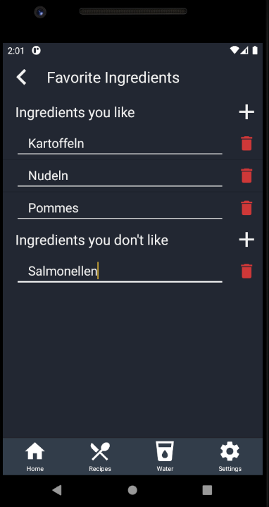

# Use-Case Specification: Rate Ingredients

# 1. Rate Ingredients 

## 1.1 Brief Description
This use case allows users to like or dislike ingredients so they will not appear in recommended searches

## 1.2 Mockup
n/a

## 1.3 Screenshot

# 2. Flow of Events

## 2.1 Basic Flow
<a href="https://viewer.diagrams.net/?highlight=0000ff&edit=_blank&layers=1&nav=1&title=Favorite%20Ingredients#R7VvZcuI4FP0aHjNlywvmMYGQTk2mZmqoruk8KlgYdYRFyWLrrx8Jy3iRHdwGm9A0Dwm6Wizfc%2B6ia9OzhovtE4PL%2BV%2FUR6QHDH%2Fbs0Y9AEzD8sQ%2FKdnFEsdWgoBhXw1KBRP8AyUzlXSFfRTlBnJKCcfLvHBKwxBNeU4GGaOb%2FLAZJfmrLmGANMFkCoku%2FQ%2F7fK6kpjtIO74gHMzVpT3gxh1vcPoeMLoK1fV6wJrtP3H3AiZrqRuN5tCnm4zIeuxZQ0Ypj78ttkNEpG4TtcXzxhW9h30zFPI6E0A8YQ3JSt361wgxtTe%2BS%2FQRbfCCwFC0HjZzzNFkCaeyayPg1y%2BpdrFGjKNtRqS28IToAnG2E0OSXtf%2Bw4knKcKYQBFmk6ofeEpp84zmnb4SQgV5cFg9vW3xRd15uRYcTQuaBsQEQT6pAAHZUgojDhmfcMilcIYJGVJC2X60Zew%2FcjBn9B1lemYz1aOrDfy02gwjpzTb0HRmlajMOoPG3Boa84VJqSYib3TzmAoe9gLRMacM%2F6Ahh%2BJCD%2FLOsTDCe4KDUHS%2BUc7pQo4O%2FXtp1UJGlyiMJcpreGVaHo%2BVlsW4MZZ3MTJFa2%2BYSN6CUan%2BiK7YFOV4Ie%2FkFDzKFK0W%2BYdicf10BdMpGoJZWESwLkBczSsAdthSLQxf3fX3uy%2BbO4%2Bsh8Hr9z%2BfwJLe2aaG7N9S5cAYw7UAS7AdGM9hwJCPheoiDfZUx2apt7Ae5nyRAALZVMFoS7RmggllVlSwLulPp3WsSzOlEsQr0XSKQADNukxQYl4foV7XvMqh6WvQ3Pt%2BDo7bQWNwaTQcHY1%2F0YKu0W0CYlsdAmJpqp%2FsIo4WXecttn3ZvKXcTejaeaHQ%2F8CDGzMmwiwwXqgIvuL%2FhFMmE%2BQr5q71IW6eoUXZS7sTV89BVdwdYUhosD%2FFsIJvMSaIiOMPpuEtYXVx19%2FXsZrAveMP0abKzvZH2Js2Msu%2BOHB6zBZHE7RH6jGMd3%2FzvrDTSG5rgHx97jqK98FnjOK6jxnhaEmg3PgLjqQ%2FoTMtku%2FoSvwl%2BF1SGob%2BQeRL3xNSfui9Xj7bR%2Fj8ySK7M9A5vvTh3ukoIDdYbC2JHrmQ8VyW1f6qWH2CAKFjVXqoS4C7KXg6DQyl8Hh6cUrTvl6olbXChmXa03VognxocUr8UVtF2nIdgho6zJRuKeNzGtAQkmz9NsPg81VtD9xFMhf7JoQyN1HNV9lMGqNtrrVLWlvMM9NE61VtUn5PJ8lGMie%2B%2BUKJtwThfGX4Q%2B8Rl2iP8ljnDEMEcrzO76R%2B9XhQsFcX5FeoKB1r69y5g2JOWFwq1kV7VWg9L%2FzEJM1RNGVsBUkrCHeUXUldpyTXPUq4OJs8O%2BEO6W9Ck2I63PbDiqvyZR3RpMSB1aZJxVHxRJqAftGfWMUUoW2i%2FOTzyhsNesfJ5ZxArn4r5PK0dwc6J5d3TeTqyAv1mxPFbSlY2cXTZrc0cY0roEkDX9LUbzWlVlJPaUItpx0fZJt5arkdv7TR1%2FOgIQyniCC%2Fl31IZI01xrE5XbytouOFipYqEB%2BXZh3tAas1UGlw5vxcVpltr0SkP14N6WmGDJUBEzTj7dh1U1tLiNXE1voVbjw5ZKp1TjQ9t3joBR2bnn5S3SH9rahz8oHT5UUSzUuQqMphn5dEWqXT6Tg1%2BIWPJ01Z455w1IgZd%2FYw7xbf7%2Bza11wDTVQGmeSMmWNGjQzyLIeTEsYc91FOXYc0aIVaXpFag3rU0jlaeC8PFEtyLVdund%2BH4cpXRRu5snZOLMWI53Z8GO7%2Fpknl20mNaNKOW3K8vDdx3XPRRDTTXznFw9OfklmP%2FwM%3D">here</a> is the activity diagram for rating an ingredient.

## 2.2 Alternative Flows
n/a

# 3. Special Requirements
n/a

# 4. Preconditions
The main preconditions for this use case are:

 1. The user has started the app and has navigated to "Settings" section.

# 5. Postconditions

### 5.1 Save changes / Sync with server
Ingredient rating is stored in the local files (no access from outside the phone)

# 6. Function Points
| Rate Ingredients         | RET   | DET | FTR | Resulting Complexity | Count | RET | DET          | FTR      |
|--------------------------|-------|-----|-----|----------------------|-------|-----|--------------|----------|
| External Inuts           | 0     | 1   | 1   | low                  | 2     |     | Like/Dislike | Settings |
| External Outputs         | 0     | 0   | 0   | low                  | 0     |     |              |          |
| External Inquiries       | 0     | 1   | 1   | low                  | 1     |     | Input        | Settings |
| Internal Logical Files   | 0     | 0   | 1   | low                  | 1     |     |              | Settings |
| External Interface Files | 0     | 0   | 0   | low                  |       |     |              |          |
| Function Points          | 14,88 |