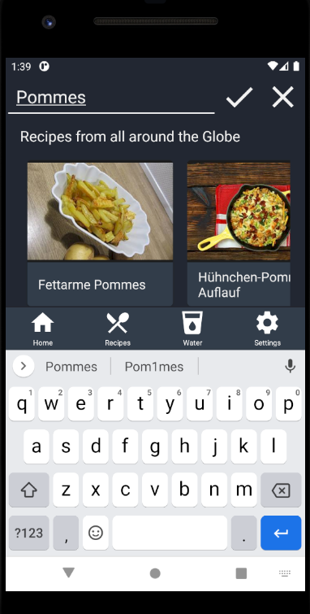
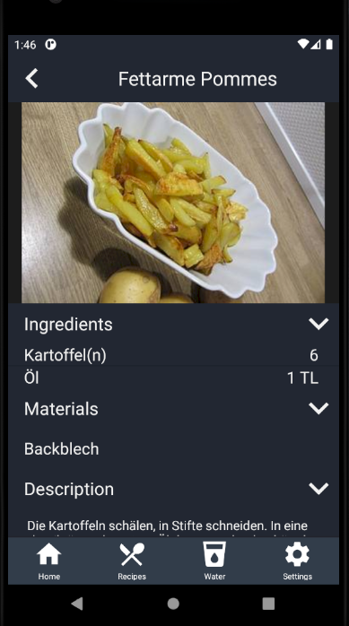

# Use-Case Specification: View API Recipe

# 1. View API Recipe

## 1.1 Brief Description
This use case allows users to read Recipes from the API.

## 1.2 Mockup
n/a

## 1.3 Screenshot

# 2. Flow of Events

## 2.1 Basic Flow 
<a href="https://viewer.diagrams.net/?highlight=0000ff&edit=_blank&layers=1&nav=1&title=ApiRecipe.drawio#R7Vtbc5s4FP41ftwdzMUmjzFxs51Jp916d5o87SggjFpAHiHHdn%2F9HhlhQCK%2BxQbXTSbTooOQxPedmw5Kz%2FKS5T1Ds%2BgTDXDcM41g2bPueqbZNywX%2FhOSVS5xbCmYMhLITqVgQn7i4kkpnZMAZ7WOnNKYk1ld6NM0xT6vyRBjdFHvFtK4PusMTbEmmPgo1qXfSMCjXOo6Rin%2FC5NpVMzcN%2BSdBBWdpSCLUEAXFZE17lkeo5TnV8nSw7EAr8Alf%2B7DK3c3C2M45fs8EP8MBrff3HBx%2F8%2F8eTz579MXf%2FGHHOUFxXP5wv9mmMkF81WBAsdLmGMU8SQGQR8uM87oD%2BzRmDKQpDSFnqOQxLEiQjGZptD0YZUwsDV6wYwTwPdW3khIEIhpRouIcDyZIV%2FMuQBtAhmj8zTA4gUMaOlvXCwfxsTLikgicI9pgjlbQZfi7kCyIdXRls1FyW0hiiq0FhwiqU3TzcAl4HAhMT8Af1PH%2F%2BP1om9dGPqWhv5klXGcXC8DzoUxYGsMaNjDKODssQJ%2FhGbifsYR4xOOuAp%2Fz7SM9Y%2FGFdwJQ3nnJB7FqSE60BG1GhC1zoWosweiAYQ42aSMR3RKUxSPS2kVaVVfnynnNIEbOA1uRYAVg8xwmktkAHePQz2jc%2Bbj3eoiXmArNwzHiJOXegxvglo%2B%2BoUSWErJqVu3kr6jsAVaN8VcPqUQtlnG8RwONA69mPg%2FQDTBiPkRXHyEhEcjtnQX%2FVccSoVYGEiyZQtSQpryJuNRjCqEH%2F%2F8RmW%2BQkDFqjZ9qmZln8ushtdsVoN2zMpSWR22a1auxuFngTAYUzqbi3WGBMP24GqtSsO%2Fc6u6uXyrArjZ6lGOv248iXTsT6do3i1lepa3VruStZ3WKNU0N4Yt%2FYot8tnNVomG5p7REABHq0q3meiQHTBPfUMLF%2FmIJ%2FUJpnOExtXT8rLPA6UzqSnfMecrqWBozmldT%2FGS8MdSjaD1VLlTapRorKrq9VjXvaea6jUroupq0MBtzoq9oeW8MZAUKrlTd4sRT6e7b%2FJDxborjmi83q%2BZxt9zLCe4ypigZlqm0XVM6Os1kU3WG1KWl9b8iKTTtXr4ZIaz6%2BXHUfix%2Bp3zo1dN3oP2Rmt3R%2B2W9rCOEk2tm%2FNEbW2eYQtRu6%2FXjSYRKIppPJBMLI6G8M%2FXa3cOakJvdZ7Q93%2BB8lMHzsHe1zm0tRNXjNZuKaW3jTacg14%2Bm%2BBYfBw0jc8pvl53oOZyG%2FS7cwe%2FQNms3Fe15g4G%2B7oDtx13oNa7bfc87kCbp5VcQS%2F7yVzhDnNE4t8oP7C7zw%2FeK35bVHR32aSjkp%2FTUn7gyPzxvCU%2Fvdij6%2BC2j85CkTr95DxUUGuo2bT6zdkcHGHEJyuiFtcVK72AImrF%2F%2FgxyjLi58IPJC5e4HiHsTkKtzODME%2FtMN6mKDddKopxlKIcFgTarLbvrQVnChuHenvl7JHpKgcWt3dvJzboByI9moaEJYBL04mLiCbP82x3mtjNhtBWEG84nOS2mf6Zw07t%2F4CvbW1Y5WV9A7P0tMhDqS%2FOcyuUydOQ2tFGsfcpqGzKzTdHHTMwE5JOH3Ao8LFKyVepg5ZmGfI4JaOQeKHn9RSCJulyYFnOCH7hFTzBsgPL9KDdL9vwK7oz2J2lMDQia14xyvgCZ%2Fw09qY5OHsvcyvSp9NT2nDAFVKQd0L3JdRUv46ej1Foln8LkIez8i8qrPH%2F">here</a> you can see the basic flow diagram for viewing an API recipe

## 2.2 Alternative Flows
A recipe from the API could also be seen when recommendet

# 3. Special Requirements
Connection to the interent

# 4. Preconditions
The main preconditions for this use case are:

 1. The user has started the app and has navigated to "Recipe" section.

# 5. Postconditions

### 5.1 Save changes / Sync with server
n/a

# 6. Function Points
| View Api Recipes         | RET  | DET | FTR | Resulting Complexity | Count | RET     | DET                      | FTR    |
|--------------------------|------|-----|-----|----------------------|-------|---------|--------------------------|--------|
| External Inuts           | 0    | 2   | 1   | low                  | 2     |         | Search icon, Recipe Card | Recipe |
| External Outputs         | 1    | 0   | 0   | low                  | 1     | Recipes |                          |        |
| External Inquiries       | 0    | 1   | 1   | low                  | 1     |         | Input Field              | Recipe |
| Internal Logical Files   | 0    | 0   | 1   | low                  | 1     |         |                          | Recipe |
| External Interface Files | 0    | 0   | 0   | low                  | 0     |         |                          |        |
| Function Points          | 18,6 |