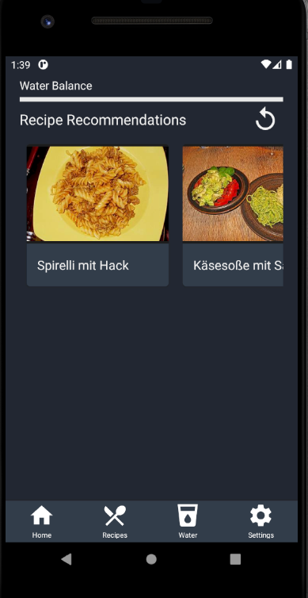

# Use-Case Specification: Get recommended Recipe

# 1. Get recommended Recipe

## 1.1 Brief Description
Find Recipes matching yur favorite Ingredients, which change every day or on user interaction

## 1.2 Mockup
n/a

## 1.3 Screenshot

# 2. Flow of Events

## 2.1 Basic Flow
<a href="https://viewer.diagrams.net/?highlight=0000ff&edit=_blank&layers=1&nav=1&title=Recommendations_flow.drawio#R7Vpbk6o4EP41Pu4WEBjlcXQuO1tna6eOtXXmPGagldQAoUK87a%2FfRIJI4oUZBT3W%2BqCkE5LwdffX6ZYeGiXLZ4az6C8aQtxzrHDZQw89x7EtNBA%2FUrIqJJ6rBFNGQjWoEozJv1DeqaQzEkJeG8gpjTnJ6sKApikEvCbDjNFFfdiExvVVMzwFQzAOcGxKf5CQR4V04FmV%2FA8g06hc2bZUT4LLwUqQRzikiy0ReuyhEaOUF1fJcgSxBK%2FEpbjvaU%2FvZmMMUt7khvnznx9vT%2FOX4ccP94140d%2FJ3P1NzTLH8Uw98D85MLVhvipR4LAUawwjnsRCYIvLnDP6ASMaUyYkKU3FyOGExLEmwjGZpqIZiF2KidFwDowTge%2B96khIGMplhouIcBhnOJBrLoQ1CRmjszQE%2BQCWaJlPXG5fzAnLLZFC4BloApytxJCNQSptlOaomotKt64SRVtqLXWIlTVNNxNXgIsLhfkn8HdM%2FF9uF33kXBf6yEB%2FvMo5JLerAQ9dlwZcQwMG9mIWQfagwR%2FhTPbnHDM%2B5pjr8PccZK0%2Fhq5Ez2Sies7CKF4N0YGJKNqBKGoLUa8BoqEIcapJGY%2FolKY4fqyk20jr9vpOOaeJ6IA0vJcBVk6SQVpIVAAffA31nM5YAMfNRT7AQd0wiDEn83oM3wW1uvWVErGVSqcaT9l9TVvC6qbA1V2awjbb%2BLoOByYvAQjBi%2BQQyAVoT4ZSWUST91m%2Bh0i2FKp5yUR8gta9ZLAH0C0vGezwErctL%2FENhFN6mp%2BURB%2FDhLfjNgJ9tnqTseB3r2z%2BVKFh3XhY1lqrY2HjqLspOyys%2FdAp0m7ol8oaymPniW7q3GlW5TdzU4E%2FXm0Ny%2BSA%2FAAd9HevUxlgMeNZOaBMgLZMdAV5qzbKaXYhXm9saP2LGJpf179rtWNne8z5qdlwpA4i%2B4b7B4e3ZMRmfvkdJiKERWb82hx17eMxDLNAWaQrDW9CU77r4HeRUGfbdaCdHbFuc8DoJNjZZpZ5Go%2B0Gtxqoa2KdGcPbqVtHicd1JB0TmQZT6tNOCeHs3OfS20zYX4G%2BQQpLMT3dwhIJmOU9Y5z4cqORVPx9a03Qr370cda8pJOGYQE1ju0JkyYjWPdv5pFj5vhA9e%2FOj5oknVfCx%2FYnfEBasoHXkd84GkRu2EW%2Btljh7GO18Xx1qxTPJA8i9c71%2BjkVplBz4oRujgz3P3PDPtt9SgzdFSeQq6Wj%2BjFxDMRg76O30XG0DcscAyx%2FGdP3Mhvlwv0ZM6%2FOBWYRcjrpYLukoZ%2B00OC3w0X6KVqd9ANF7j24eLEkfEtkYdZ1v1GsUw7HoBjEt%2FwWUJPHi9PIOVivwSBfPIssW69AiMCKvmv7qms4jdkFaejUgTSUgKvpYqnd7d7nVZZwjGrGFXqURDFulRR5B%2B3Sxl6%2BuHu%2BOu6Y8r4BQoTX%2FfyzpxXC71ewyPB2fyrySsIh17qkKq45CsdyPF2A3j%2BdzpEs3oDsFBA9R4levwP">here</a> is the activity diagram for getting a recommendation.

## 2.2 Alternative Flows
A recommendation can be forced by pressing "refresh"

# 3. Special Requirements
Connection to the interent

# 4. Preconditions
The main preconditions for this use case are:

 1. The user has started the app and has navigated to "Home" section.

# 5. Postconditions

### 5.1 Save changes / Sync with server
n/a

# 6. Function Points
| View Recommended Recipes | RET | DET | FTR | Resulting Complexity | Count | RET | DET                | FTR    |
|--------------------------|-----|-----|-----|----------------------|-------|-----|--------------------|--------|
| External Inuts           | 0   | 1   | 0   | low                  | 1     |     | Recipe Detail Card |        |
| External Outputs         | 0   | 1   | 0   | low                  | 1     |     | Recipes            |        |
| External Inquiries       | 0   | 1   | 1   | low                  | 1     |     | Refresh Button     | Recipe |
| Internal Logical Files   | 0   | 0   | 0   | low                  | 0     |     |                    |        |
| External Interface Files | 0   | 0   | 0   | low                  | 0     |     |                    |        |
| Function Points          | 9,3 |